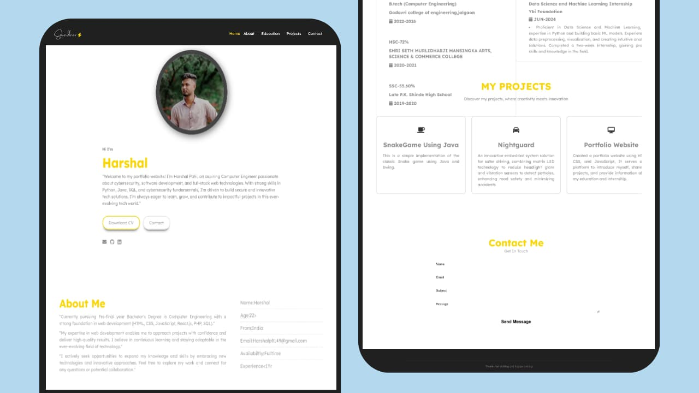

# Harshal-Personal-Portfolio 🌐🖥️

A personal portfolio website built using HTML and CSS to showcase my skills, projects, and achievements. This website reflects my journey as a Computer Engineering student with a focus on web development, cybersecurity, and Python programming. 💻🔒

## Features 🚀
- **Responsive Design**: Optimized for all screen sizes 📱💻
- **Showcase of Projects**: Highlights various web development and Python projects 📂🖥️
- **About Me Section**: A brief introduction and my skill set 👨‍💻
- **Contact Information**: Easy way to reach out for collaborations or inquiries 📧🤝



## Technologies Used 🛠️
- HTML
- CSS

## How to View the Portfolio 👀
1. Clone the repository:
   ```bash
   git clone https://github.com/HarshalPatil9977/Harshal-Personal-Portfolio.git
